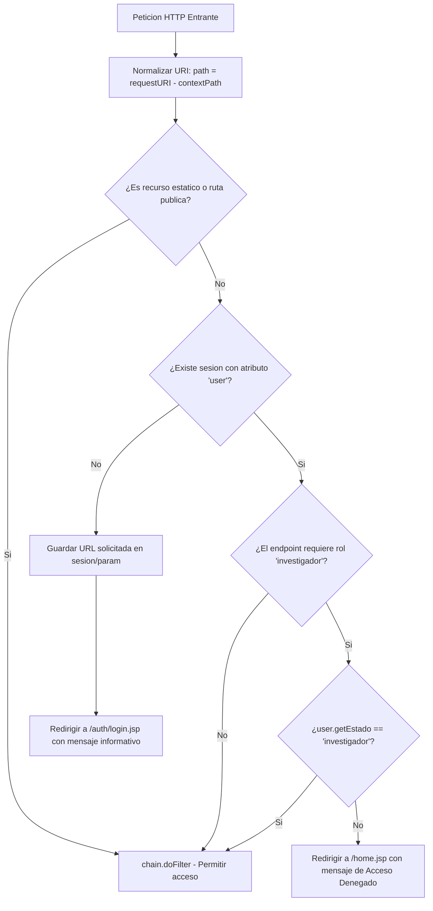

# Plan de Implementación: Punto 3.1 - Filtro de Autenticación y Autorización (`AuthFilter`)

**Proyecto:** Bestiario (Jakarta EE 10 / Apache Tomcat 10.1+ / MySQL 8)  
**Fecha:** Octubre 2026  
**Documento de Referencia:** `docs/correcciones.md` (Punto 3.1)  
**Estado:** Pendiente de Ejecución  

---

## 1. Resumen Ejecutivo y Diagnóstico

### 1.1. Contexto Actual
El sistema Bestiario cuenta con más de 40 servlets y múltiples páginas JSP para la administración de bestias, hábitats, categorías, evidencias, noticias, usuarios y solicitudes de investigadores.

Actualmente, **no existe ningún filtro Jakarta EE (`Filter` / `@WebFilter`)** en el proyecto. Aunque algunas páginas JSP (como `adminDashboard.jsp`) incluyen verificaciones manuales de sesión en código Java scriptlet, **los servlets de backend que realizan las operaciones de mutación y consulta crítica carecen de validación de identidad o rol**.

### 1.2. Riesgos de Seguridad Detectados
- **Escalada de privilegios y bypass de autenticación:** Cualquier cliente HTTP (curl, Postman, formularios externos) puede invocar directamente servlets como:
  - `POST /investigadores/aprobarSolicitud?idUsuario=X` (asigna rol de investigador a cualquier usuario).
  - `POST /investigadores/rechazarSolicitud?idUsuario=X` (elimina postulaciones o blanquea perfiles).
  - `GET /investigadores/listarSolicitantes` (expone información confidencial de postulantes como DNI, nombre y correo).
  - `POST /bestias/eliminar?id=X` (elimina entidades de la base de datos sin autorización).
  - Mutaciones en categorías, hábitats, evidencias y noticias.
- **Acceso anónimo a formularios internos:** Ciertas vistas pueden ser solicitadas directamente sin sesión previa.

---

## 2. Matriz de Control de Acceso

La aplicación se dividirá en 3 zonas de seguridad claramente delimitadas:

```
┌────────────────────────────────────────────────────────┐
│                   ZONAS DE SEGURIDAD                   │
├────────────────────┬───────────────────┬───────────────┤
│ 1. PÚBLICA         │ 2. AUTENTICADA    │ 3. PRIVADA    │
│    (Anónimo)       │    (Cualquier rol)│    (Invest.)  │
└────────────────────┴───────────────────┴───────────────┘
```

### 2.1. Zona 1: Pública (Acceso Libre Sin Sesión)
- **Recursos estáticos:**
  - `/css/*`, `/js/*`, `/img/*`, `/images/*`, `/favicon.ico`
- **Páginas generales:**
  - `/home.jsp`, `/`, `/index.jsp`
- **Módulo de autenticación:**
  - `/auth/login`, `/auth/login.jsp`
  - `/auth/register`, `/auth/register.jsp`
  - `/forgot-password`, `/auth/forgotPassword.jsp`
  - `/auth/resetPassword`, `/auth/resetPassword.jsp`
  - `/auth/logout.jsp`
- **Módulos de consulta y lectura comunitaria:**
  - `/bestias/listar`, `/bestias/bestias.jsp`
  - `/registros/obtenerRegistroConBestia`, `/registros/registro.jsp`
  - `/noticias/listar`, `/noticias/noticias.jsp`
  - `/mapas/mapa.jsp`, `/mapas/bestia`, `/mapas/bestias`

---

### 2.2. Zona 2: Autenticada (Requiere Sesión Activa - Rol `lector`, `solicitante` o `investigador`)
Requiere `session != null && session.getAttribute("user") != null`. Si no se cumple, redirige al login.

- **Interacción y aportes comunitarios:**
  - `/comentarios/agregar` (agregar comentarios en registros de bestias)
  - `/investigadores/presentarCandidatura.jsp` (formulario para postularse a investigador)
  - `/investigadores/crearSolicitud` (envío de solicitud de postulación)
  - `/bestias/crearPropuestaBestia.jsp` (propuesta de una nueva bestia)
  - `/bestias/crear` (procesamiento de propuesta de bestia; si es lector se registra como `pendiente`)
  - `/registros/nuevoRegistro.jsp` (propuesta de avistamiento o actualización de registro)
  - `/registros/actualizarRegistro` (envío de propuesta de actualización)
  - `/evidencias/crear` (subida de evidencias)

---

### 2.3. Zona 3: Privada / Restringida (Exclusivo Rol `investigador`)
Requiere `session != null && session.getAttribute("user") != null` y además `user.getEstado().equals("investigador")`. Si no es investigador, bloquea con código 403 o redirección con advertencia de permisos insuficientes.

- **Dashboard administrativo:**
  - `/admin/*`, `/admin/adminDashboard.jsp`
- **Gestión de investigadores y postulaciones:**
  - `/investigadores/listarSolicitantes`
  - `/investigadores/solicitudesInvestigador.jsp`
  - `/investigadores/aprobarSolicitud`
  - `/investigadores/rechazarSolicitud`
- **Gestión de lectores:**
  - `/lectores/listar`
  - `/lectores/actualizar`
  - `/lectores/eliminar`
- **Gestión y moderación de Bestias y Registros:**
  - `/bestias/aprobar`
  - `/bestias/eliminar`
  - `/bestias/editar`, `/bestias/editarBestia.jsp`
  - `/bestias/actualizar`
  - `/bestias/cambiarHabitat`
  - `/bestias/cambiarCategoria`
  - `/registros/aceptarRegistro`
  - `/registros/registrosPendientes.jsp`
  - `/registros/obtenerRegistrosPendientesBestia`
- **Gestión de Categorías y Hábitats:**
  - `/categorias/crear`, `/categorias/actualizar`, `/categorias/eliminar`, `/categorias/listar`
  - `/habitats/crear`, `/habitats/actualizar`, `/habitats/eliminar`, `/habitats/listar`
  - `/habitats/crearCaracteristicaHabitat`, `/habitats/actualizarCaracteristicaHabitat`, `/habitats/eliminarCaracteristicaHabitat`, `/habitats/listarCaracteristicasHabitat`
  - `/mapas/mapaCargaHabitat.jsp`
- **Gestión de Evidencias y Contenido:**
  - `/evidencias/aprobar`
  - `/evidencias/eliminar`
  - `/evidencias/crearTipoEvidencia`, `/evidencias/actualizarTipoEvidencia`, `/evidencias/eliminarTipoEvidencia`, `/evidencias/listarTiposEvidencia`
  - `/noticias/crear`, `/noticias/eliminar`, `/noticias/redactarNoticia.jsp`
  - `/comentarios/eliminar`

---

## 3. Diagrama de Flujo de Intercepción



---

## 4. Diseño Técnico de `AuthFilter`

### 4.1. Ubicación y Definición
- **Paquete:** `filters`
- **Clase:** `AuthFilter`
- **Archivo:** `src/main/java/filters/AuthFilter.java`
- **Mapeo:** `@WebFilter("/*")`

### 4.2. Estrategia de Implementación
1. **Normalización de URI:**
   ```java
   String uri = httpRequest.getRequestURI();
   String contextPath = httpRequest.getContextPath();
   String path = uri.substring(contextPath.length());
   ```
2. **Conjuntos de Verificación O(1):**
   - `Set<String> PUBLIC_EXACT_PATHS`
   - `List<String> PUBLIC_PREFIXES`
   - `List<String> INVESTIGADOR_PREFIXES`
   - `Set<String> INVESTIGADOR_EXACT_PATHS`
   - `Set<String> AUTHENTICATED_EXACT_PATHS`
3. **Preservación de Destino (`urlAnterior`):**
   Permite que cuando un usuario es interceptado e inicia sesión en `SvLogin`, sea redirigido automáticamente a la pantalla que intentaba visualizar.
4. **Manejo Seguro de Errores y Sesiones:**
   Uso de `session.setAttribute("logMsg", ...)` y `session.setAttribute("errorGlobal", ...)` asegurando que los mensajes flash no se pierdan entre redirecciones.

---

## 5. Código Propuesto (`AuthFilter.java`)

```java
package filters;

import java.io.IOException;
import java.util.Arrays;
import java.util.HashSet;
import java.util.List;
import java.util.Set;

import entities.Usuario;
import helpers.HttpRoutes;
import jakarta.servlet.Filter;
import jakarta.servlet.FilterChain;
import jakarta.servlet.FilterConfig;
import jakarta.servlet.ServletException;
import jakarta.servlet.ServletRequest;
import jakarta.servlet.ServletResponse;
import jakarta.servlet.annotation.WebFilter;
import jakarta.servlet.http.HttpServletRequest;
import jakarta.servlet.http.HttpServletResponse;
import jakarta.servlet.http.HttpSession;

@WebFilter("/*")
public class AuthFilter implements Filter {

    private static final List<String> STATIC_EXTENSIONS = Arrays.asList(
        ".css", ".js", ".png", ".jpg", ".jpeg", ".gif", ".svg", ".ico", ".woff", ".woff2", ".ttf"
    );

    private static final List<String> PUBLIC_PREFIXES = Arrays.asList(
        "/css/", "/js/", "/img/", "/images/", "/auth/"
    );

    private static final Set<String> PUBLIC_EXACT_PATHS = new HashSet<>(Arrays.asList(
        "", "/", "/home.jsp", "/forgot-password",
        "/bestias/listar", "/bestias/bestias.jsp",
        "/registros/obtenerRegistroConBestia", "/registros/registro.jsp",
        "/noticias/listar", "/noticias/noticias.jsp",
        "/mapas/mapa.jsp", "/mapas/bestia", "/mapas/bestias"
    ));

    private static final List<String> INVESTIGADOR_PREFIXES = Arrays.asList(
        "/admin/", "/lectores/", "/habitats/", "/categorias/"
    );

    private static final Set<String> INVESTIGADOR_EXACT_PATHS = new HashSet<>(Arrays.asList(
        "/investigadores/listarSolicitantes",
        "/investigadores/solicitudesInvestigador.jsp",
        "/investigadores/aprobarSolicitud",
        "/investigadores/rechazarSolicitud",
        "/bestias/aprobar",
        "/bestias/eliminar",
        "/bestias/editar",
        "/bestias/editarBestia.jsp",
        "/bestias/actualizar",
        "/bestias/cambiarHabitat",
        "/bestias/cambiarCategoria",
        "/registros/aceptarRegistro",
        "/registros/registrosPendientes.jsp",
        "/registros/obtenerRegistrosPendientesBestia",
        "/evidencias/aprobar",
        "/evidencias/eliminar",
        "/evidencias/crearTipoEvidencia",
        "/evidencias/actualizarTipoEvidencia",
        "/evidencias/eliminarTipoEvidencia",
        "/evidencias/listarTiposEvidencia",
        "/noticias/crear",
        "/noticias/eliminar",
        "/noticias/redactarNoticia.jsp",
        "/comentarios/eliminar",
        "/mapas/mapaCargaHabitat.jsp"
    ));

    @Override
    public void init(FilterConfig filterConfig) throws ServletException {}

    @Override
    public void doFilter(ServletRequest request, ServletResponse response, FilterChain chain)
            throws IOException, ServletException {

        HttpServletRequest httpRequest = (HttpServletRequest) request;
        HttpServletResponse httpResponse = (HttpServletResponse) response;

        String uri = httpRequest.getRequestURI();
        String contextPath = httpRequest.getContextPath();
        String path = uri.substring(contextPath.length());

        // 1. Recursos estáticos por extensión
        for (String ext : STATIC_EXTENSIONS) {
            if (path.toLowerCase().endsWith(ext)) {
                chain.doFilter(request, response);
                return;
            }
        }

        // 2. Prefijos públicos
        for (String prefix : PUBLIC_PREFIXES) {
            if (path.startsWith(prefix)) {
                chain.doFilter(request, response);
                return;
            }
        }

        // 3. Rutas exactas públicas
        if (PUBLIC_EXACT_PATHS.contains(path)) {
            chain.doFilter(request, response);
            return;
        }

        // 4. Verificación de sesión activa
        HttpSession session = httpRequest.getSession(false);
        Usuario usuario = (session != null) ? (Usuario) session.getAttribute("user") : null;

        if (usuario == null) {
            if (session == null) {
                session = httpRequest.getSession(true);
            }
            session.setAttribute("logMsg", "Debe iniciar sesión para acceder a la funcionalidad solicitada.");
            String redirectUrl = HttpRoutes.LOGIN_JSP(contextPath) + "?urlAnterior=" + uri;
            httpResponse.sendRedirect(redirectUrl);
            return;
        }

        // 5. Verificación de rol 'investigador'
        boolean requiresInvestigador = isInvestigadorPath(path);
        if (requiresInvestigador && !"investigador".equals(usuario.getEstado())) {
            session.setAttribute("errorGlobal", "Acceso denegado: se requieren permisos de investigador.");
            httpResponse.sendRedirect(HttpRoutes.HOME_JSP(contextPath));
            return;
        }

        // 6. Autorización exitosa
        chain.doFilter(request, response);
    }

    private boolean isInvestigadorPath(String path) {
        if (INVESTIGADOR_EXACT_PATHS.contains(path)) {
            return true;
        }
        for (String prefix : INVESTIGADOR_PREFIXES) {
            if (path.startsWith(prefix)) {
                return true;
            }
        }
        return false;
    }

    @Override
    public void destroy() {}
}
```

---

## 6. Plan de Pruebas y Matriz de Validación

| Caso de Prueba | Usuario | Endpoint Consultado | Resultado Esperado |
| :--- | :--- | :--- | :--- |
| **CP-01** | Anónimo | `GET /home.jsp`, `/bestias/listar`, `/mapas/mapa.jsp` | Acceso permitido (200 OK) |
| **CP-02** | Anónimo | `GET /css/main.css` | Acceso permitido (estático servido) |
| **CP-03** | Anónimo | `GET /admin/adminDashboard.jsp` | Redirección a `/auth/login.jsp` con mensaje |
| **CP-04** | Anónimo | `POST /investigadores/aprobarSolicitud?idUsuario=1` | Redirección a `/auth/login.jsp` (bloqueo total) |
| **CP-05** | Anónimo | `POST /bestias/eliminar?id=1` | Redirección a `/auth/login.jsp` (bloqueo total) |
| **CP-06** | Lector | `POST /comentarios/agregar` | Acceso permitido |
| **CP-07** | Lector | `GET /bestias/crearPropuestaBestia.jsp` | Acceso permitido (propuesta ciudadana) |
| **CP-08** | Lector | `GET /admin/adminDashboard.jsp` | Redirección a `/home.jsp` con "Acceso denegado" |
| **CP-09** | Lector | `POST /bestias/eliminar?id=1` | Redirección a `/home.jsp` con "Acceso denegado" |
| **CP-10** | Lector | `POST /investigadores/aprobarSolicitud?idUsuario=2` | Redirección a `/home.jsp` con "Acceso denegado" |
| **CP-11** | Investigador | `GET /admin/adminDashboard.jsp` | Acceso permitido (200 OK) |
| **CP-12** | Investigador | `POST /bestias/aprobar`, `POST /bestias/eliminar` | Acceso permitido |

---

## 7. Fases de Ejecución

1. **Creación:** Generar `src/main/java/filters/AuthFilter.java`.
2. **Verificación de Compilación:** Compilar y empaquetar con `mvn clean compile` y `mvn package`.
3. **Auditoría:** Actualizar `docs/correcciones.md` marcando el punto 3.1 como resuelto.
