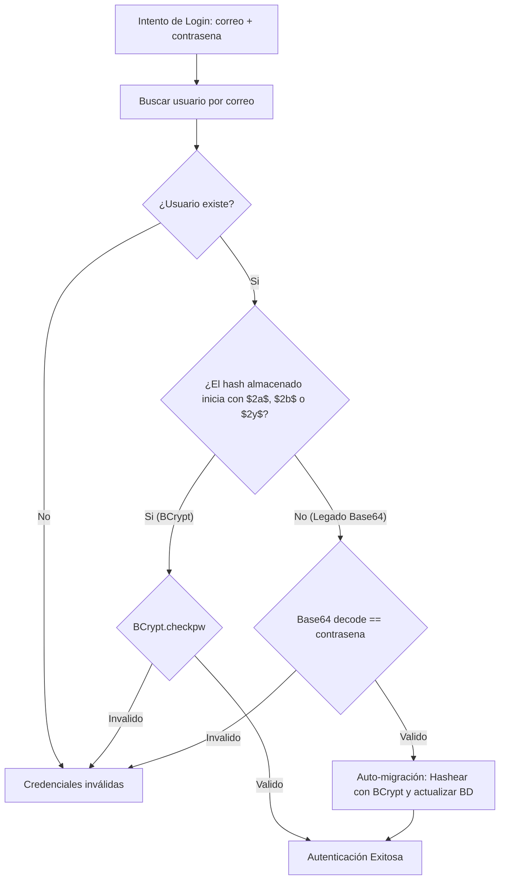

# Plan de Implementación: Punto 2.2 - Hashing Criptográfico Unidireccional con Salt (Reemplazo de Base64)

**Proyecto:** Bestiario (Jakarta EE 10 / Apache Tomcat 10.1+ / MySQL 8)  
**Fecha:** Octubre 2026  
**Documento de Referencia:** `docs/correcciones.md` (Punto 2.2)  
**Estado:** Propuesta de Implementación  

---

## 1. Resumen Ejecutivo y Diagnóstico

### 1.1. Diagnóstico del Problema
En `src/main/java/logic/LogicUsuario.java` (líneas 53-61), el sistema implementa la gestión de contraseñas mediante:
```java
public static String hashPassword(String pass) {
    String encoded = Base64.getEncoder().encodeToString(pass.getBytes(StandardCharsets.UTF_8));
    return encoded.toString();
}

public static String dehashPassword(String pass) {
    String decoded = new String(Base64.getDecoder().decode(pass.getBytes(StandardCharsets.UTF_8)));
    return decoded.toString();
}
```

### 1.2. Riesgos de Seguridad y Vulnerabilidad Crítica
- **Falsa Encriptación:** Base64 no es un algoritmo criptográfico ni de hashing, sino una simple codificación de caracteres reversible en texto plano.
- **Exposición Total:** Cualquier usuario con acceso a un backup SQL o lectura en la base de datos puede descifrar todas las contraseñas al instante.
- **Riesgo Académico / Auditoría:** La presencia de métodos como `dehashPassword(...)` evidencia el almacenamiento de contraseñas en texto claro reversible, lo que constituye un motivo habitual de reprobación en una entrega formal de ingeniería de software.

---

## 2. Elección Tecnológica: BCrypt

Se adopta **BCrypt** como estándar criptográfico para el almacenamiento de contraseñas por las siguientes razones:
1. **Unidireccional:** Es matemáticamente imposible "deshashear" o recuperar la contraseña original.
2. **Salt Aleatorio Automático:** Cada hash genera e incorpora internamente un salt de 16 bytes único (`$2a$12$...`), lo que neutraliza por completo ataques con tablas Rainbow y colisiones precalculadas.
3. **Factor de Trabajo Adaptativo (Cost Factor):** Se configura en `12` (estándar OWASP), lo que dificulta ataques de fuerza bruta por hardware especializado (GPU/ASIC).
4. **Compatibilidad con la Base de Datos:** Los hashes BCrypt miden exactamente 60 caracteres, por lo que encajan sin alterar la columna `contraseña varchar(255)` de la tabla `usuario`.
5. **Biblioteca:** `org.mindrot:jbcrypt:0.4` (librería compacta ~26 KB, sin dependencias transitivas, estándar probado en entornos Java EE).

---

## 3. Estrategia de Migración Transparente (Lazy Migration)

Para evitar que los usuarios precargados en `docs/seed_data.sql` (que tienen contraseña `'123'` guardada como `'MTIz'`) queden bloqueados o requieran reiniciar la base de datos, se diseña un mecanismo de **verificación dual con migración bajo demanda**:



1. Si el hash comienza con `$2a$`, se valida mediante `BCrypt.checkpw(...)`.
2. Si es un hash legado (Base64), se valida contra la decodificación Base64.
3. **Si la validación legada es exitosa**, el sistema inmediatamente genera un hash BCrypt con salt y lo actualiza en la base de datos (`usDAO.updatePassword(...)`).
4. A partir de ese momento, la cuenta queda permanentemente asegurada con BCrypt sin intervención del usuario.

---

## 4. Matriz de Cambios por Componente

| Archivo / Componente | Modificación Requerida | Detalle |
| :--- | :--- | :--- |
| [`pom.xml`](file:///c:/Facu/Java/Bestiario/pom.xml) | Agregar dependencia | `org.mindrot:jbcrypt:0.4` |
| [`LogicUsuario.java`](file:///c:/Facu/Java/Bestiario/src/main/java/logic/LogicUsuario.java) | Refactorizar hashing | • `hashPassword(pass)` -> genera `BCrypt.hashpw(pass, BCrypt.gensalt(12))`.<br>• `checkPassword(usuario, rawPass)` -> validación BCrypt con fallback y actualización automática.<br>• Eliminar llamadas a `dehashPassword`.<br>• En `getOne` y `findAll`, no mutar la contraseña en memoria.<br>• En `save(Usuario)` y `updatePassword(...)`, aplicar BCrypt. |
| [`SvLogin.java`](file:///c:/Facu/Java/Bestiario/src/main/java/servlet/auth/SvLogin.java) | Delegar autenticación | Reemplazar comparación manual `contrasena.equals(LogicUsuario.dehashPassword(...))` por `controladorUsuario.checkPassword(usuario, contrasena)`. |
| [`CrearSolicitud.java`](file:///c:/Facu/Java/Bestiario/src/main/java/servlet/Investigador/CrearSolicitud.java) | Corregir instanciación | Eliminar la llamada a `dehashPassword(user.getContrasena())`, preservando el hash existente del usuario de la sesión sin re-hashear. |
| [`seed_data.sql`](file:///c:/Facu/Java/Bestiario/docs/seed_data.sql) | Actualizar datos iniciales | Actualizar los registros de prueba (`juan@bestiario.com`, `maria@bestiario.com`, etc.) con el hash BCrypt correspondiente a `'123'`. |

---

## 5. Diseño del Código Propuesto

### 5.1. Dependencia Maven en `pom.xml`
```xml
<dependency>
    <groupId>org.mindrot</groupId>
    <artifactId>jbcrypt</artifactId>
    <version>0.4</version>
</dependency>
```

### 5.2. Métodos Criptográficos en `LogicUsuario.java`
```java
package logic;

import org.mindrot.jbcrypt.BCrypt;
// ...

public class LogicUsuario {
    private DataUsuario usDAO = new DataUsuario();

    public static String hashPassword(String plainPassword) {
        if (plainPassword == null || plainPassword.isEmpty()) {
            return plainPassword;
        }
        return BCrypt.hashpw(plainPassword, BCrypt.gensalt(12));
    }

    public boolean checkPassword(Usuario usuario, String plainPassword) {
        if (usuario == null || plainPassword == null) {
            return false;
        }
        String storedHash = usuario.getContrasena();
        if (storedHash == null || storedHash.isEmpty()) {
            return false;
        }

        // 1. Verificación moderna con BCrypt
        if (storedHash.startsWith("$2a$") || storedHash.startsWith("$2b$") || storedHash.startsWith("$2y$")) {
            try {
                return BCrypt.checkpw(plainPassword, storedHash);
            } catch (Exception e) {
                return false;
            }
        }

        // 2. Verificación de respaldo para migración de contraseñas legadas (Base64)
        try {
            String decoded = new String(java.util.Base64.getDecoder().decode(storedHash), java.nio.charset.StandardCharsets.UTF_8);
            if (plainPassword.equals(decoded)) {
                // Auto-migración a BCrypt en segundo plano
                updatePassword(usuario.getIdUsuario(), plainPassword);
                usuario.setContrasena(hashPassword(plainPassword));
                return true;
            }
        } catch (Exception ignored) {
            // No era Base64 válido
        }

        return false;
    }

    public void updatePassword(int idUsuario, String newPassword) {
        usDAO.updatePassword(idUsuario, hashPassword(newPassword));
    }
}
```

### 5.3. Simplificación de `SvLogin.java`
```java
if (usuario != null && controladorUsuario.checkPassword(usuario, contrasena)) {
    HttpSession session = request.getSession();
    session.setAttribute("user", usuario);
    // Redirección...
} else {
    request.getSession().setAttribute("logMsg", "Credenciales incorrectas.");
    rd.forward(request, response);
}
```

---

## 6. Plan de Pruebas y Validación

| Caso de Prueba | Escenario | Procedimiento | Resultado Esperado |
| :--- | :--- | :--- | :--- |
| **CP-HASH-01** | Registro de usuario | Registrar nuevo usuario mediante `SvRegister`. | La columna `contraseña` almacena un string de 60 caracteres que inicia con `$2a$12$`. |
| **CP-HASH-02** | Login con usuario BCrypt | Iniciar sesión con el usuario registrado en CP-HASH-01. | Autenticación exitosa si coincide; error amigable si la contraseña es errónea. |
| **CP-HASH-03** | Migración de usuario legado | Iniciar sesión con un usuario precargado en seed (`'MTIz'` / clave `'123'`). | Acceso concedido y la base de datos actualiza automáticamente el campo `contraseña` con un hash BCrypt válido. |
| **CP-HASH-04** | Segundo login usuario migrado | Iniciar sesión nuevamente con el usuario del CP-HASH-03. | Autenticación directa a través de `BCrypt.checkpw`. |
| **CP-HASH-05** | Reset de contraseña | Completar el flujo de recuperación de clave en `SvResetPassword`. | La nueva contraseña se almacena hasheada con BCrypt. |
| **CP-HASH-06** | Postulación a investigador | Usuario lector envía postulación en `CrearSolicitud`. | El usuario se actualiza a `solicitante` sin corromper ni re-hashear su contraseña existente. |

---

## 7. Pasos de Ejecución

1. Incorporar la dependencia `jbcrypt:0.4` en `pom.xml`.
2. Refactorizar `LogicUsuario.java` implementando `hashPassword` y `checkPassword` con lazy-migration.
3. Actualizar `SvLogin.java` y `CrearSolicitud.java`.
4. Actualizar `docs/seed_data.sql` con hashes BCrypt estándar para las cuentas iniciales.
5. Ejecutar `mvn clean compile` y `mvn package` para verificar ausencia de errores de compilación.
6. Actualizar `docs/correcciones.md` retirando el punto 2.2.
